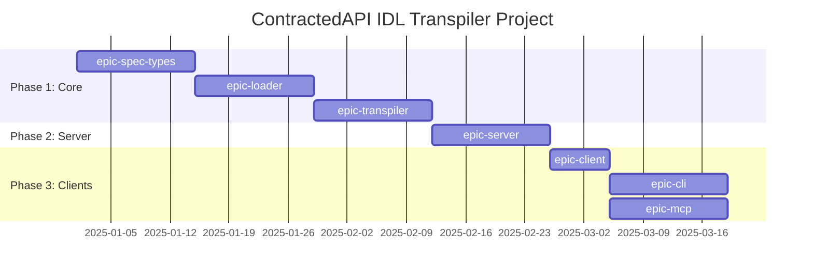

# Project: openapi-transpiler - Checklist

## Gantt Chart

## Epic Checklist

- [ ] **epic-spec-types** - Foundation types (APISpec, Contract, ContractCard, JSON Schema utilities)
  - Tracker: [epic-spec-types/](./epic-spec-types/)
  - Branch: `openapi-transpiler/epic-spec-types/epic`
  - Worktree: `C:\Users\smart\Documents\Repos\ContractedAPI\deno.worktrees\OpenapiTranspiler.EpicSpecTypes.Epic`

- [ ] **epic-loader** - Loading, glob resolution, $ref resolution, component merging
  - Tracker: [epic-loader/](./epic-loader/)
  - Branch: `openapi-transpiler/epic-loader/epic`
  - Worktree: `C:\Users\smart\Documents\Repos\ContractedAPI\deno.worktrees\OpenapiTranspiler.EpicLoader.Epic`

- [ ] **epic-transpiler** - TypeScript and OpenAPI 3 output generation
  - Tracker: [epic-transpiler/](./epic-transpiler/)
  - Branch: `openapi-transpiler/epic-transpiler/epic`
  - Worktree: `C:\Users\smart\Documents\Repos\ContractedAPI\deno.worktrees\OpenapiTranspiler.EpicTranspiler.Epic`

- [ ] **epic-server** - REST server generation (Hono router, validation, WebSocket)
  - Tracker: [epic-server/](./epic-server/)
  - Branch: `openapi-transpiler/epic-server/epic`
  - Worktree: `C:\Users\smart\Documents\Repos\ContractedAPI\deno.worktrees\OpenapiTranspiler.EpicServer.Epic`

- [ ] **epic-client** - Common client foundation for CLI and MCP
  - Tracker: [epic-client/](./epic-client/)
  - Branch: `openapi-transpiler/epic-client/epic`
  - Worktree: `C:\Users\smart\Documents\Repos\ContractedAPI\deno.worktrees\OpenapiTranspiler.EpicClient.Epic`

- [ ] **epic-cli** - CLI entry point and command generation
  - Tracker: [epic-cli/](./epic-cli/)
  - Branch: `openapi-transpiler/epic-cli/epic`
  - Worktree: `C:\Users\smart\Documents\Repos\ContractedAPI\deno.worktrees\OpenapiTranspiler.EpicCli.Epic`

- [ ] **epic-mcp** - MCP tool generation and server integration
  - Tracker: [epic-mcp/](./epic-mcp/)
  - Branch: `openapi-transpiler/epic-mcp/epic`
  - Worktree: `C:\Users\smart\Documents\Repos\ContractedAPI\deno.worktrees\OpenapiTranspiler.EpicMcp.Epic`

- [ ] Write comprehensive README.md (replace GitHub stub after project matures)
