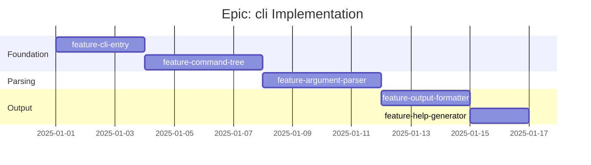

# Epic: cli - Checklist

## Gantt Chart

## Feature Checklist

- [ ] **feature-cli-entry** - Main entry point and global options
  - `contracted` main command
  - Global options: `--base-url`, `--format`, `--verbose`, `--quiet`
  - Configuration file loading (`.contractedrc`, `contracted.config.ts`)
  - Environment variable support (`CONTRACTED_BASE_URL`)
  - Version command (`contracted --version`)
  - Exit code handling (0=success, 1=error, 2=validation)
  - Files: `src/cli/main.ts`, `src/cli/config.ts`

- [ ] **feature-command-tree** - Hierarchical command structure from contracts
  - Parse contract paths into command tree
  - Path segments become command groups
  - `operationId` or method+path becomes subcommand name
  - Path parameters become positional arguments
  - Static `build(contracts)` tree generator
  - Command aliasing support
  - Files: `src/cli/commands/generate.ts`

- [ ] **feature-argument-parser** - Schema to CLI argument mapping
  - Request schema analysis
  - Required properties -> required arguments
  - Optional properties -> optional arguments with defaults
  - Type coercion: string -> number, boolean, array, object
  - Path parameters -> positional arguments
  - Query parameters -> `--param value` options
  - Body parameters -> `--body` or `--data @file.json`
  - Array handling: `--tag a --tag b` or `--tag a,b`
  - Files: `src/cli/parser/args.ts`, `src/cli/parser/coerce.ts`

- [ ] **feature-output-formatter** - Response output formatting
  - JSON format: raw JSON output
  - Table format: tabular display with headers
  - Plain format: minimal output for piping
  - YAML format: structured output (optional)
  - Streaming response handling
  - Error response formatting
  - Color output (disable with `--no-color` or `NO_COLOR` env)
  - Pagination support for large responses
  - Files: `src/cli/output/json.ts`, `src/cli/output/table.ts`, `src/cli/output/plain.ts`

- [ ] **feature-help-generator** - Auto-generated help from contracts
  - Command descriptions from `contract.description`
  - Parameter descriptions from `schema.description`
  - Usage examples from `contract.examples`
  - Grouped help by path prefix
  - Bash completion script generation
  - Zsh completion script generation
  - Man page generation (optional)
  - Files: `src/cli/help.ts`

## Acceptance Criteria

### Must Have
- [ ] Commands generated from contract paths
- [ ] Path parameters work as positional arguments
- [ ] Required arguments are enforced
- [ ] JSON output works correctly
- [ ] Help text shows parameter descriptions
- [ ] Exit codes are correct (0/1/2)

### Should Have
- [ ] Table output for interactive use
- [ ] Configuration file support
- [ ] Environment variable overrides
- [ ] Type coercion for numbers/booleans
- [ ] Array argument handling

### Nice to Have
- [ ] Shell completion scripts
- [ ] Interactive mode (prompt for missing args)
- [ ] Request/response history
- [ ] Color output
- [ ] Man page generation
