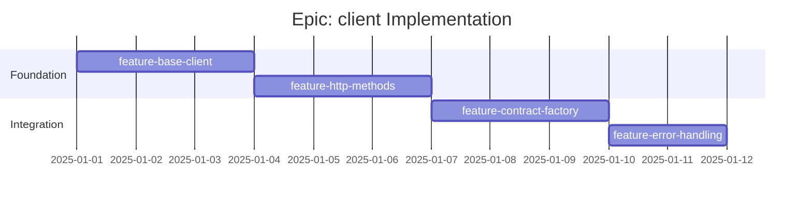

# Epic: client - Checklist

## Gantt Chart

## Feature Checklist

- [ ] **feature-base-client** - Client class with URL composition
  - `Client` class with constructor overloads
  - String URL initialization
  - Parent `HasUrl` + path initialization
  - `url` getter with lazy composition
  - `path` getter for full path tracking
  - `#full(path)` internal URL builder
  - Files: `src/client/client.ts`, `src/client/types.ts`

- [ ] **feature-http-methods** - HTTP method helpers
  - `simple(method, path?, specificCode?)` for bodyless requests
  - `complex(method, path?, body?, specificCode?)` for requests with body
  - Method overloads for flexible call signatures
  - JSON.stringify for request bodies
  - JSON.parse for response bodies (with empty handling)
  - Convenience methods: `get()`, `head()`, `delete()`, `post()`, `put()`, `patch()`
  - Files: `src/client/methods.ts` (or inline in client.ts)

- [ ] **feature-contract-factory** - Contract to client method mapping
  - `create(contract)` factory function
  - Route method based on contract.method
  - Build URL from contract.path
  - Type-safe request/response inference
  - Integration point for generated `miniclient()`
  - Files: `src/client/factory.ts`

- [ ] **feature-error-handling** - Error classes and detection
  - `ResponseError` class with message and status
  - HTTP response.ok check
  - Specific status code validation (optional parameter)
  - `alive(path?, specificCode?)` helper returning boolean
  - Error message extraction from response
  - Files: `src/client/errors.ts`

## Acceptance Criteria

### Must Have
- [ ] Client correctly composes URLs from parent chain
- [ ] GET/HEAD/DELETE work without body
- [ ] POST/PUT/PATCH serialize body as JSON
- [ ] Response bodies correctly parsed as JSON
- [ ] Non-OK responses throw ResponseError
- [ ] ResponseError includes status code

### Should Have
- [ ] Empty response bodies handled gracefully
- [ ] Specific status code validation
- [ ] `alive()` helper for health checks
- [ ] Method overloads for ergonomic API

### Nice to Have
- [ ] Timeout configuration
- [ ] Retry logic
- [ ] Request/response interceptors
- [ ] AbortController support
