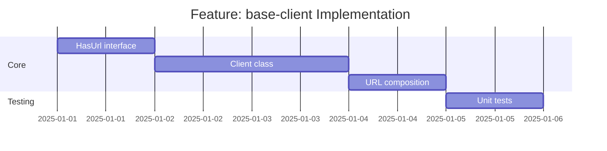

# Feature: base-client - Checklist

## Gantt Chart

## Task Checklist

- [ ] Define `HasUrl` interface with url and path
- [ ] Create `Client` class with dual constructors
- [ ] Implement URL composition getter
- [ ] Implement path tracking getter
- [ ] Handle trailing slash normalization
- [ ] Write unit tests

## Acceptance Criteria

- [ ] URL correctly resolved through chain
- [ ] Path segments properly joined
- [ ] Works with nested clients
