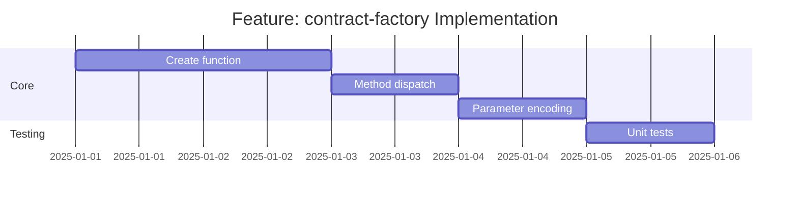

# Feature: contract-factory - Checklist

## Gantt Chart

## Task Checklist

- [ ] Implement `create<TReq, TRes>(contract, client)` factory
- [ ] Dispatch to simple/complex based on method
- [ ] Implement query parameter encoding for GET
- [ ] Implement path parameter interpolation
- [ ] Return typed function `(request?: TReq) => Promise<TRes>`
- [ ] Write unit tests
