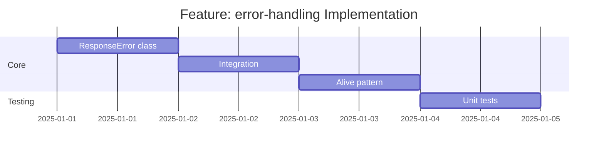

# Feature: error-handling (client) - Checklist

## Gantt Chart

## Task Checklist

- [ ] Create `ResponseError` class with message and status
- [ ] Integrate error throwing in simple/complex methods
- [ ] Implement `alive(path?)` health check pattern
- [ ] Write unit tests
