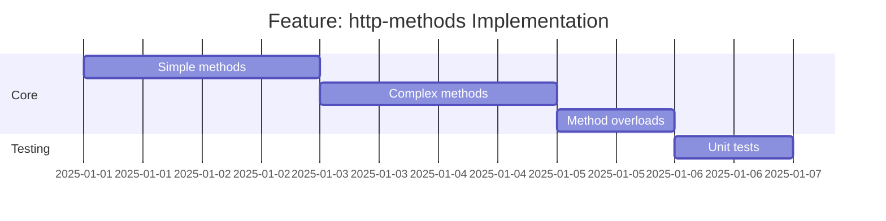

# Feature: http-methods - Checklist

## Gantt Chart

## Task Checklist

- [ ] Implement `simple(method, path?, specificCode?)`
- [ ] Implement `complex(method, pathOrBody?, body?, specificCode?)`
- [ ] Implement `get(path?, specificCode?)`
- [ ] Implement `head(path?, specificCode?)`
- [ ] Implement `delete(path?, specificCode?)`
- [ ] Implement `post(pathOrBody?, body?)` with overloads
- [ ] Implement `put(pathOrBody?, body?)` with overloads
- [ ] Implement `patch(pathOrBody?, body?)` with overloads
- [ ] Handle JSON parsing and empty responses
- [ ] Write unit tests
