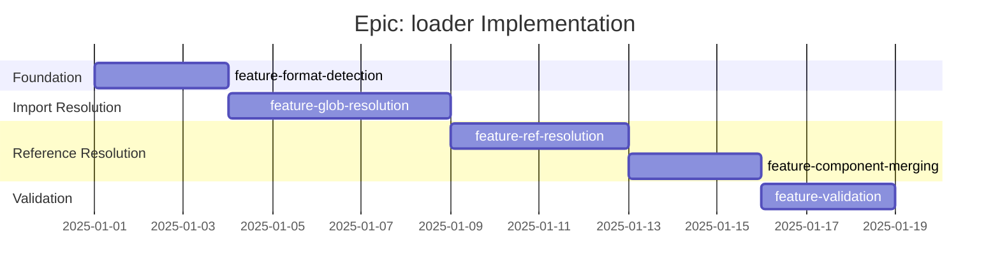

# Epic: loader - Checklist

## Gantt Chart

## Feature Checklist

- [ ] **feature-format-detection** - Multi-format parsing (YAML, JSON, TOML)
  - Format auto-detection from file extension
  - Consistent parsing interface across formats
  - Async and sync loading APIs
  - Base URL resolution for module paths
  - Files: `src/loader/format.ts`, `src/loader/loader.ts`

- [ ] **feature-glob-resolution** - ContractCard glob import resolution
  - Parse `#./pattern/*.yaml` syntax
  - Expand glob patterns to file lists
  - Apply path/method override rules based on import location
  - Document-order merging for same path.method
  - Files: `src/loader/glob.ts`

- [ ] **feature-ref-resolution** - `$ref` pointer resolution
  - Parse JSON Pointer syntax (`#/components/schemas/User`)
  - Resolve local references within document
  - Detect and report circular references
  - Preserve unresolvable external refs for downstream handling
  - Files: `src/loader/refs.ts`

- [ ] **feature-component-merging** - Component namespace merging
  - Merge ContractCard `components` into main spec
  - Detect naming conflicts
  - Apply merge strategy (first-wins, last-wins, or error)
  - Maintain source tracking for debugging
  - Files: `src/loader/components.ts`

- [ ] **feature-validation** - Spec and contract validation
  - Validate loaded spec against Specification type
  - Validate each contract has required fields
  - Validate HTTP methods are valid
  - Produce helpful error messages with context
  - Files: `src/loader/validate.ts`

## Acceptance Criteria

### Must Have
- [ ] YAML and JSON specs load correctly
- [ ] Glob patterns expand to matching files
- [ ] ContractCards merge into correct path.method locations
- [ ] `$ref` references resolve to actual schemas
- [ ] Circular references detected and reported
- [ ] Invalid specs produce clear error messages

### Should Have
- [ ] TOML format support
- [ ] Sync and async loading APIs
- [ ] Source file tracking in loaded contracts
- [ ] Line number context in error messages

### Nice to Have
- [ ] Remote URL loading (http/https specs)
- [ ] Caching for repeated loads
- [ ] Watch mode for development
- [ ] Schema validation against JSON Schema meta-schema
