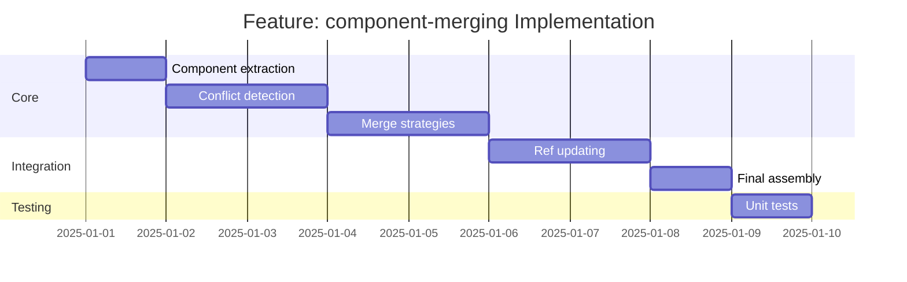

# Feature: component-merging - Checklist

## Gantt Chart

## Task Checklist

- [ ] Define `MergeStrategy` type
  - `"error" | "namespace" | "first-wins" | "last-wins"`
- [ ] Define `MergeOptions` interface
  - Strategy selection
  - Namespace separator
  - Component type filters
- [ ] Create `extractComponents(card: ContractCard): ComponentsObject`
  - Pull components from card
  - Return empty object if none
- [ ] Create `detectConflicts(main: ComponentsObject, card: ComponentsObject): Conflict[]`
  - Compare each component type
  - Check for name collisions
  - Return list of conflicts with details
- [ ] Create `areSchemasSame(a: JSONSchema, b: JSONSchema): boolean`
  - Deep equality check
  - Handle ref normalization
- [ ] Implement `mergeWithError(main, card, conflicts)`
  - Throw on any conflict
  - Include conflict details in error
- [ ] Implement `mergeWithNamespace(main, card, cardName, conflicts)`
  - Prefix conflicting names
  - Update internal refs to use new names
- [ ] Implement `mergeWithFirstWins(main, card)`
  - Skip existing names
  - Add only new names
- [ ] Implement `mergeWithLastWins(main, card)`
  - Replace all from card
- [ ] Create `updateRefs(data: unknown, oldName: string, newName: string): unknown`
  - Find refs pointing to old name
  - Update to new name
- [ ] Create main `mergeComponents(spec: Specification, cards: ContractCard[], options: MergeOptions): Specification`
  - Orchestrate full merge process
- [ ] Handle edge cases
  - Empty components
  - Missing component types
  - Self-referencing schemas
- [ ] Write unit tests

## Acceptance Criteria

- [ ] All strategies work correctly
- [ ] Conflicts detected accurately
- [ ] Namespace refs updated properly
- [ ] Error messages include conflict location
- [ ] Final spec is valid ContractedAPI
