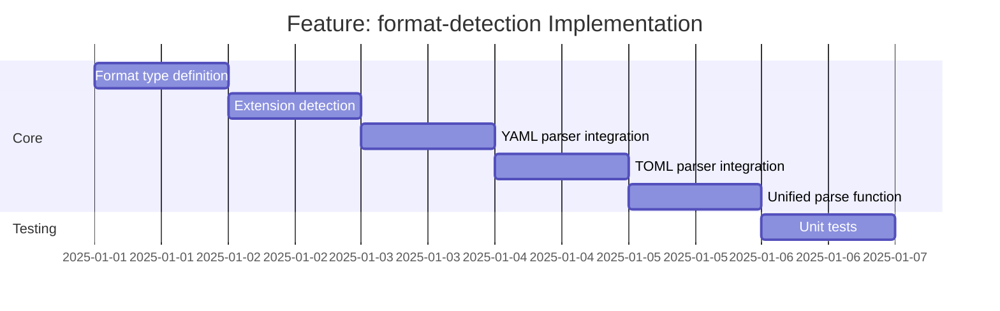

# Feature: format-detection - Checklist

## Gantt Chart

## Task Checklist

- [ ] Define `Format` type (`"json" | "yaml" | "toml"`)
- [ ] Create `detectFormat(path: string): Format` function
  - Extract file extension
  - Map to format type
  - Throw for unknown extensions
- [ ] Create `parseYaml(content: string): unknown` wrapper
  - Import from `@std/yaml`
  - Handle parse errors
- [ ] Create `parseToml(content: string): unknown` wrapper
  - Import from `@std/toml`
  - Handle parse errors
- [ ] Create `parseJson(content: string): unknown` wrapper
  - Use native `JSON.parse`
  - Handle parse errors with better messages
- [ ] Create unified `parse(content: string, format: Format): unknown`
  - Dispatch to appropriate parser
- [ ] Create `parseFile(path: string): Promise<unknown>`
  - Read file content
  - Detect format
  - Parse and return
- [ ] Handle edge cases
  - Empty files
  - Invalid syntax
  - Mixed case extensions
- [ ] Write unit tests for all functions

## Acceptance Criteria

- [ ] All format types correctly detected
- [ ] All parsers produce equivalent output for equivalent input
- [ ] Error messages include file path and line number when possible
- [ ] Empty files return `undefined` or empty object (configurable)
