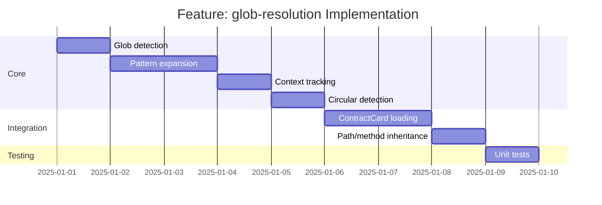

# Feature: glob-resolution - Checklist

## Gantt Chart

## Task Checklist

- [ ] Define `GlobMatch` type for pattern results
- [ ] Create `isGlobPattern(key: string): boolean`
  - Check for `#./` prefix
  - Validate pattern syntax
- [ ] Create `expandGlobPattern(pattern: string, baseDir: string): AsyncIterable<string>`
  - Strip `#./` prefix
  - Resolve relative to base directory
  - Use `@std/fs/expandGlob`
- [ ] Create `ImportContext` type
  - Track current path override
  - Track current method override
  - Track visited files for circular detection
- [ ] Create `processGlobImport(pattern: string, context: ImportContext): Promise<ContractCard[]>`
  - Expand pattern to files
  - Load each file
  - Apply context overrides
- [ ] Implement circular include detection
  - Track visited file paths (normalized)
  - Throw descriptive error on cycle
- [ ] Implement path inheritance logic
  - Root level: use card's path
  - Under path: override card's path
  - Under method: override both
- [ ] Create `normalizeContractCard(card: unknown, context: ImportContext): ContractCard`
  - Validate card structure
  - Apply path/method overrides
  - Preserve components
- [ ] Handle edge cases
  - Non-matching glob (empty result)
  - Invalid card structure
  - Missing required fields
- [ ] Write unit tests

## Acceptance Criteria

- [ ] All glob patterns correctly expanded
- [ ] Context inheritance works at all levels
- [ ] Circular includes detected before infinite loop
- [ ] Error messages include pattern and context
