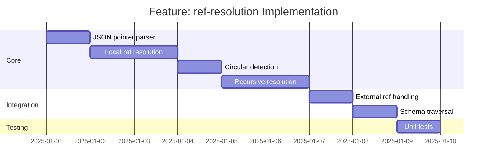

# Feature: ref-resolution - Checklist

## Gantt Chart

## Task Checklist

- [ ] Create `parseJsonPointer(ref: string): string[]`
  - Handle `#/` prefix
  - Split by `/`
  - Decode escaped characters (`~0` -> `~`, `~1` -> `/`)
- [ ] Create `isLocalRef(ref: string): boolean`
  - Check for `#/` prefix without file path
- [ ] Create `resolvePointer(pointer: string[], document: unknown): unknown`
  - Traverse document following pointer segments
  - Throw if path not found
- [ ] Create `RefContext` for circular detection
  - Track visited refs
  - Build resolution chain for error messages
- [ ] Create `resolveRef(ref: string, document: unknown, ctx: RefContext): unknown`
  - Check if local ref
  - Check for circular
  - Resolve and return
- [ ] Create `resolveRefs(data: unknown, document: unknown, ctx?: RefContext): unknown`
  - Recursively traverse data
  - Resolve any `$ref` found
  - Preserve non-local refs
- [ ] Handle edge cases
  - Empty pointer (`#/`)
  - Missing target
  - Nested refs (ref pointing to another ref)
- [ ] Write unit tests

## Acceptance Criteria

- [ ] All local refs correctly resolved
- [ ] Circular refs detected with helpful error
- [ ] External refs preserved unchanged
- [ ] Deeply nested schemas fully resolved
- [ ] Escaped characters handled correctly
