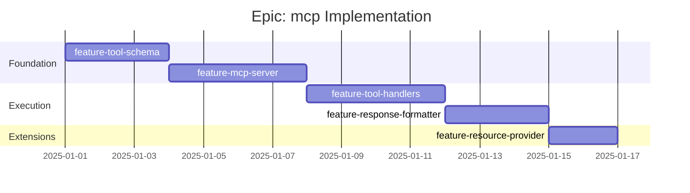

# Epic: mcp - Checklist

## Gantt Chart

## Feature Checklist

- [ ] **feature-tool-schema** - Contract to MCP tool schema generation
  - Contract name -> tool name mapping
  - Contract description -> tool description
  - Request schema -> input schema conversion
  - Path parameters as required inputs
  - Body parameters as nested input object
  - Enum constraints preservation
  - Validation rules (min/max, pattern) as descriptions
  - Files: `src/mcp/tools/generate.ts`, `src/mcp/tools/types.ts`

- [ ] **feature-mcp-server** - MCP server setup and lifecycle
  - Server initialization with name/version
  - Capabilities declaration (tools, resources)
  - Stdio transport implementation
  - SSE transport implementation (optional)
  - Graceful shutdown handling
  - Health check endpoint
  - Configuration via environment/file
  - Files: `src/mcp/server.ts`, `src/mcp/transport/stdio.ts`

- [ ] **feature-tool-handlers** - Tool execution to HTTP mapping
  - Tool call parsing and validation
  - Contract lookup by tool name
  - Path parameter interpolation (`/users/{id}` -> `/users/123`)
  - Query parameter encoding for GET requests
  - Request body construction for POST/PUT/PATCH
  - HTTP client integration (epic-client)
  - Timeout and retry handling
  - Error capture and propagation
  - Files: `src/mcp/tools/handler.ts`

- [ ] **feature-response-formatter** - LLM-friendly response transformation
  - JSON to human-readable text
  - Success response formatting
  - Error response formatting with helpful messages
  - Large response truncation with notice
  - Array formatting (list items)
  - Object formatting (key-value pairs)
  - Date/time formatting
  - Null/undefined handling
  - Files: `src/mcp/format/response.ts`, `src/mcp/format/error.ts`

- [ ] **feature-resource-provider** - MCP resources from API metadata
  - API documentation as text resource
  - Contract list as resource
  - Individual contract schemas as resources
  - Health/status resource
  - Resource URI scheme (`api://contracts/createUser`)
  - Resource subscription (optional)
  - Files: `src/mcp/resources/generate.ts`, `src/mcp/resources/provider.ts`

## Acceptance Criteria

### Must Have
- [ ] Tools generated from all contracts
- [ ] Tool input schemas match request schemas
- [ ] Tool execution calls correct HTTP endpoints
- [ ] Successful responses returned to MCP client
- [ ] Error responses formatted with status and message
- [ ] Server starts and handles tool calls via stdio

### Should Have
- [ ] Path parameters correctly interpolated
- [ ] Query parameters encoded for GET requests
- [ ] Response formatted for LLM readability
- [ ] Large responses truncated appropriately
- [ ] Resources provide API documentation

### Nice to Have
- [ ] SSE transport for web integration
- [ ] Streaming response support
- [ ] Tool call caching
- [ ] Rate limiting
- [ ] Request/response logging
