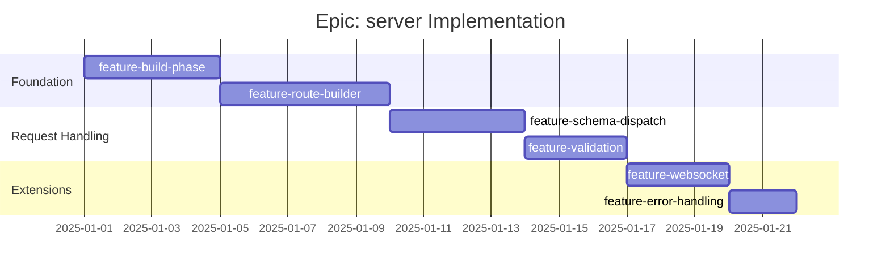

# Epic: server - Checklist

## Gantt Chart

## Feature Checklist

- [ ] **feature-build-phase** - BuildPhase class for lazy dependency resolution
  - Implement `BuildPhase<T>` with PromiseLike interface
  - Dependency tracking with `depends()` method
  - Lazy execution with `run()` trigger
  - Idempotent execution (run once, return same promise)
  - Error propagation with context
  - Optional: cancellation, progress tracking, cycle detection
  - Files: `src/server/phase.ts`

- [ ] **feature-route-builder** - Hierarchical route tree builder
  - Implement `RouteBuilder extends Map<string, RouteBuilder>`
  - `ensure(path)` and `enforce(segments)` navigation
  - Contract collection per node
  - BuildPhase integration (init, handlers, setup, children, build)
  - Memoized phase creation
  - Static `build(contracts)` entry point
  - Files: `src/server/builder.ts`

- [ ] **feature-schema-dispatch** - Schema-based request routing
  - AJV schema compilation for each contract
  - Request parsing (JSON body, query params)
  - Schema matching in document order
  - Next handler chain on non-match
  - `SubrouteNotFoundError` (422) when no contract matches
  - Files: `src/server/dispatch.ts`

- [ ] **feature-validation** - Request/response validation middleware
  - Request body validation against contract schema
  - Response validation (optional, for development)
  - Error schema validation
  - Validation error formatting
  - Configurable strictness options
  - Files: `src/server/validation.ts`

- [ ] **feature-websocket** - WebSocket upgrade handling
  - Detect `ws: true` contracts
  - `upgradeWebSocket` middleware integration
  - Dynamic module import for handlers
  - Handler signature: `module.ws(context)`
  - Hono WebSocket adapter compatibility
  - Files: `src/server/websocket.ts`

- [ ] **feature-error-handling** - Error classes and formatting
  - `SubrouteNotFoundError` - No matching contract (422)
  - `InvalidResponseError` - Response validation failed (500)
  - `CodedError` - Error with status code
  - Consistent JSON error response structure
  - Hono `onError` handler integration
  - Files: `src/server/errors.ts`

## Acceptance Criteria

### Must Have
- [ ] Routes generated from contracts array
- [ ] Multiple contracts per path.method dispatch correctly
- [ ] Request validation blocks invalid requests
- [ ] Type-safe handler bindings compile
- [ ] WebSocket contracts upgrade correctly
- [ ] Errors return appropriate status codes

### Should Have
- [ ] Response validation (configurable)
- [ ] Helpful error messages with contract context
- [ ] HEAD requests handled through GET routes
- [ ] Query parameter JSON parsing

### Nice to Have
- [ ] BuildPhase improvements (cancellation, progress)
- [ ] Hot reload for handler modules
- [ ] Request/response logging middleware
- [ ] CORS middleware integration
