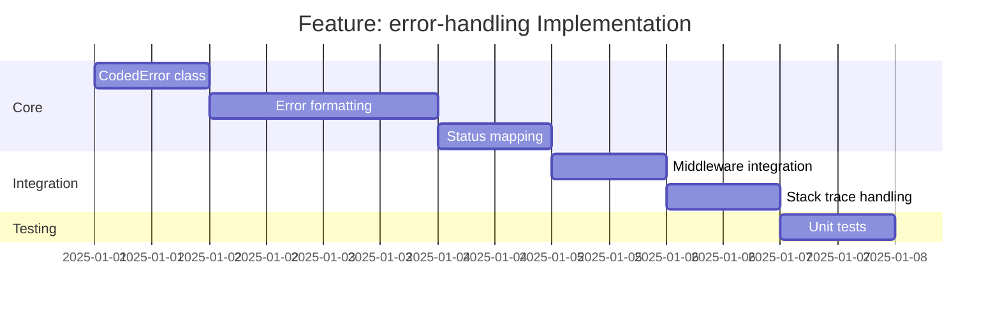

# Feature: error-handling - Checklist

## Gantt Chart

## Task Checklist

- [ ] Create `CodedError` class with message and status
- [ ] Create error code constants (400, 404, 500, etc.)
- [ ] Implement `formatError(error: unknown): ErrorResponse`
- [ ] Implement `errorToResponse(error: unknown): Response`
- [ ] Handle validation errors specially
- [ ] Configure stack trace visibility by environment
- [ ] Write unit tests

## Acceptance Criteria

- [ ] All errors have consistent shape
- [ ] Status codes correctly mapped
- [ ] Validation errors include details
- [ ] Production hides stack traces
