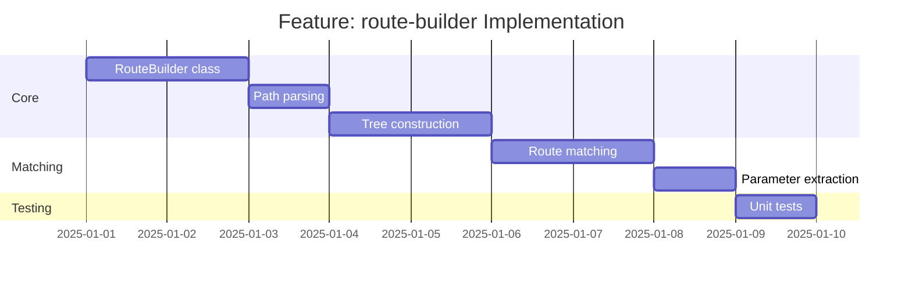

# Feature: route-builder - Checklist

## Gantt Chart

## Task Checklist

- [ ] Define `RouteNode` interface
- [ ] Create `RouteBuilder extends Map<string, RouteBuilder>`
- [ ] Implement path segment parsing
- [ ] Implement `add(path: string, handler: RouteHandler)`
- [ ] Implement `match(path: string): MatchResult`
- [ ] Implement path parameter extraction
- [ ] Handle static vs dynamic segments
- [ ] Write unit tests

## Acceptance Criteria

- [ ] Routes correctly organized in tree
- [ ] Matching returns correct handler
- [ ] Parameters extracted from path
- [ ] Edge cases handled (root, trailing slash)
