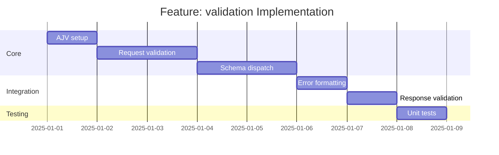

# Feature: validation - Checklist

## Gantt Chart

## Task Checklist

- [ ] Configure AJV with appropriate options
- [ ] Create `validate(data: unknown, schema: JSONSchema): ValidationResult`
- [ ] Create `findMatchingContract(body: unknown, contracts: Contract[]): Contract | null`
- [ ] Implement schema-based dispatch for multiple contracts
- [ ] Format validation errors with path and message
- [ ] Optional: Validate response before sending
- [ ] Write unit tests

## Acceptance Criteria

- [ ] Valid requests pass through
- [ ] Invalid requests rejected with details
- [ ] Correct contract selected via schema dispatch
- [ ] Error messages are user-friendly
