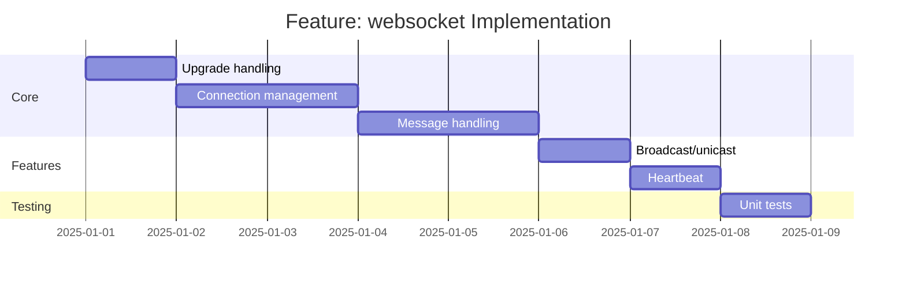

# Feature: websocket - Checklist

## Gantt Chart

## Task Checklist

- [ ] Implement WebSocket upgrade detection
- [ ] Create connection registry
- [ ] Implement message parsing and validation
- [ ] Create typed message handlers
- [ ] Implement broadcast to all connections
- [ ] Implement unicast to specific connection
- [ ] Add heartbeat/ping-pong
- [ ] Write unit tests

## Acceptance Criteria

- [ ] HTTP upgrades to WebSocket
- [ ] Messages validated against schema
- [ ] Connections tracked properly
- [ ] Clean disconnect handling
