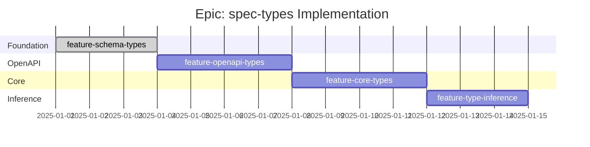

# Epic: spec-types - Checklist

## Gantt Chart

## Feature Checklist

- [x] **feature-schema-types** - JSON serializable types and FromSchema wrapper
  - Tracker: [feature-schema-types/](./feature-schema-types/)
  - Branch: `openapi-transpiler/epic-spec-types/feature-schema-types/feature`
  - Worktree: `OpenapiTranspiler.EpicSpecTypes.FeatureSchemaTypes`
  - Files: `src/schema/types.ts`, `src/schema/mod.ts`
  - Status: APPROVED - Ready for merge

- [ ] **feature-openapi-types** - OpenAPI 3.1 compatibility types
  - Tracker: [feature-openapi-types/](./feature-openapi-types/)
  - Branch: `openapi-transpiler/epic-spec-types/feature-openapi-types/feature`
  - Worktree: `OpenapiTranspiler.EpicSpecTypes.FeatureOpenapiTypes`
  - Files: `src/spec/openapi.ts`, `src/spec/helpers.ts`

- [ ] **feature-core-types** - ContractedAPI-specific types
  - Tracker: [feature-core-types/](./feature-core-types/)
  - Branch: `openapi-transpiler/epic-spec-types/feature-core-types/feature`
  - Worktree: `OpenapiTranspiler.EpicSpecTypes.FeatureCoreTypes`
  - Files: `src/spec/types.ts`, `src/spec/mod.ts`

- [ ] **feature-type-inference** - Type inference helpers
  - Tracker: [feature-type-inference/](./feature-type-inference/)
  - Branch: `openapi-transpiler/epic-spec-types/feature-type-inference/feature`
  - Worktree: `OpenapiTranspiler.EpicSpecTypes.FeatureTypeInference`
  - Files: `src/schema/inference.ts`, `src/schema/lookup.ts`

## Acceptance Criteria

### Must Have
- [ ] All types compile without errors under `strict: true`
- [ ] `FromSchema` correctly infers types from `as const` schemas
- [ ] Type guards work correctly at runtime
- [ ] All OpenAPI 3.1 core types are present
- [ ] Field aliases typed correctly (contractedapi/openapi, spec/paths, events/webhooks)
- [ ] `ContractCardPath` type correctly identifies glob patterns

### Should Have
- [ ] JSDoc comments on all public types
- [ ] Examples in comments for complex types
- [ ] Re-exports organized in `mod.ts` files

### Nice to Have
- [ ] Branded types for contract names (colon:case validation)
- [ ] Strict literal types for HTTP methods
- [ ] Comprehensive test file with type assertions
