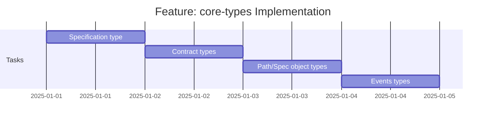

# Feature: core-types - Checklist

## Gantt Chart

## Task Checklist

> **Note**: Tasks will be defined when this feature is commenced.

- [x] Implement Specification type with field aliases
- [x] Implement Contract type
- [x] Implement ContractCard type
- [x] Implement ContractCardPath with type guard
- [ ] Implement SpecObject and PathItemObject
- [ ] Implement ContractCollection type
- [ ] Implement EventsObject and EventDefinition
- [ ] Create mod.ts with public exports
- [ ] Add JSDoc documentation

## Acceptance Criteria

- [ ] All types compile under `strict: true`
- [ ] Field aliases correctly typed (both names work)
- [ ] `isContractCardPath` correctly identifies glob patterns
- [ ] All ContractedAPI-specific types present
- [ ] JSDoc comments on all public types
