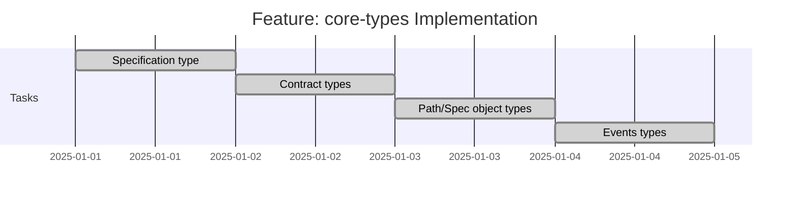

# Feature: core-types - Checklist

## Gantt Chart

## Task Checklist

- [x] [task-spec-type](task-spec-type/TASK_CHECKLIST.md) - Branch: `openapi-transpiler/epic-spec-types/feature-core-types/task-spec-type/task` - [Worktree](C:\Users\smart\Documents\Repos\ContractedAPI\deno.worktrees\OpenapiTranspiler.EpicSpecTypes.FeatureCoreTypes.TaskSpecType)
- [x] [task-contract-types](task-contract-types/TASK_CHECKLIST.md) - Branch: `openapi-transpiler/epic-spec-types/feature-core-types/task-contract-types/task` - [Worktree](C:\Users\smart\Documents\Repos\ContractedAPI\deno.worktrees\OpenapiTranspiler.EpicSpecTypes.FeatureCoreTypes.TaskContractTypes)
- [x] [task-path-spec-types](task-path-spec-types/TASK_CHECKLIST.md) - Branch: `openapi-transpiler/epic-spec-types/feature-core-types/task-path-spec-types/task` - [Worktree](C:\Users\smart\Documents\Repos\ContractedAPI\deno.worktrees\OpenapiTranspiler.EpicSpecTypes.FeatureCoreTypes.TaskPathSpecTypes)
- [x] [task-events-module](task-events-module/TASK_CHECKLIST.md) - Branch: `openapi-transpiler/epic-spec-types/feature-core-types/task-events-module/task` - [Worktree](C:\Users\smart\Documents\Repos\ContractedAPI\deno.worktrees\OpenapiTranspiler.EpicSpecTypes.FeatureCoreTypes.TaskEventsModule)

## Acceptance Criteria

- [x] All types compile under `strict: true`
- [x] Field aliases correctly typed (both names work)
- [x] `isContractCardPath` correctly identifies glob patterns
- [x] All ContractedAPI-specific types present
- [x] JSDoc comments on all public types
