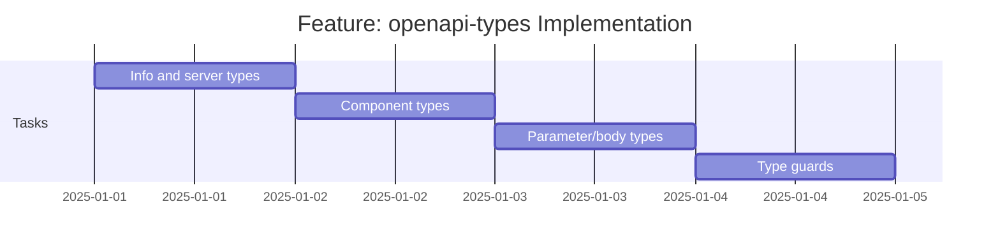

# Feature: openapi-types - Checklist

## Gantt Chart

## Task Checklist

> **Note**: Tasks will be defined when this feature is commenced.

- [ ] Implement InfoObject, ServerObject, TagObject types
- [ ] Implement ComponentsObject type
- [ ] Implement ReferenceObject with type guard
- [ ] Implement ParameterObject, RequestBodyObject, ResponseObject
- [ ] Implement SecuritySchemeObject and related types
- [ ] Implement HttpMethod type
- [ ] Implement helper type guards
- [ ] Add JSDoc documentation

## Acceptance Criteria

- [ ] All types compile under `strict: true`
- [ ] Type guards correctly identify reference objects
- [ ] All OpenAPI 3.1 core types present
- [ ] JSDoc comments on all public types
