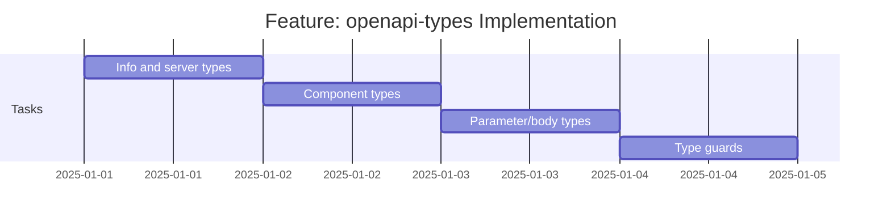

# Feature: openapi-types - Checklist

## Gantt Chart

## Task Checklist

- [x] [task-info-server-types](./task-info-server-types/) - InfoObject, ServerObject, TagObject types
  - Branch: `openapi-transpiler/epic-spec-types/feature-openapi-types/task-info-server-types/task`
  - Worktree: `OpenapiTranspiler.EpicSpecTypes.FeatureOpenapiTypes.TaskInfoServerTypes`
  - Status: APPROVED
- [x] [task-component-types](./task-component-types/) - ComponentsObject, ReferenceObject, HttpMethod types
  - Branch: `openapi-transpiler/epic-spec-types/feature-openapi-types/task-component-types/task`
  - Worktree: `OpenapiTranspiler.EpicSpecTypes.FeatureOpenapiTypes.TaskComponentTypes`
  - Status: APPROVED
- [x] [task-request-response-types](./task-request-response-types/) - ParameterObject, RequestBodyObject, ResponseObject, SecuritySchemeObject
  - Branch: `openapi-transpiler/epic-spec-types/feature-openapi-types/task-request-response-types/task`
  - Worktree: `OpenapiTranspiler.EpicSpecTypes.FeatureOpenapiTypes.TaskRequestResponseTypes`
  - Status: APPROVED
- [x] [task-type-guards](./task-type-guards/) - Type guard helpers
  - Branch: `openapi-transpiler/epic-spec-types/feature-openapi-types/task-type-guards/task`
  - Worktree: `OpenapiTranspiler.EpicSpecTypes.FeatureOpenapiTypes.TaskTypeGuards`
  - Status: APPROVED

## Acceptance Criteria

- [x] All types compile under `strict: true`
- [x] Type guards correctly identify reference objects
- [x] All OpenAPI 3.1 core types present
- [x] JSDoc comments on all public types
