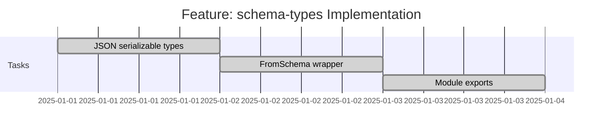

# Feature: schema-types - Checklist

## Gantt Chart

## Task Checklist

- [x] Implement JSON serializable types
  - Branch: `openapi-transpiler/epic-spec-types/feature-schema-types/task-json-types/task`
  - [task-json-types](./task-json-types/)
- [x] Implement FromSchema wrapper with `& JSONObject` correction
  - Branch: `openapi-transpiler/epic-spec-types/feature-schema-types/task-from-schema/task`
  - [task-from-schema](./task-from-schema/)
- [x] Create mod.ts with public exports
  - Branch: `openapi-transpiler/epic-spec-types/feature-schema-types/task-module-exports/task`
  - [task-module-exports](./task-module-exports/)

## Acceptance Criteria

- [x] All types compile under `strict: true`
- [x] `FromSchema` correctly infers types from `as const` schemas
- [x] `JSONObject` intersection applied to object types
- [x] Re-exports organized in `mod.ts`
- [x] JSDoc comments on all public types
