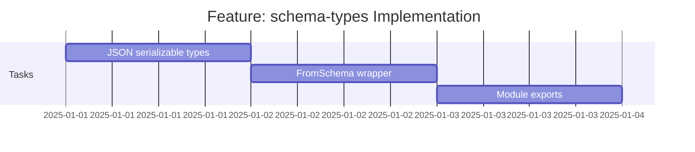

# Feature: schema-types - Checklist

## Gantt Chart

## Task Checklist

> **Note**: Tasks will be defined when this feature is commenced.

- [x] Implement JSON serializable types
- [ ] Implement FromSchema wrapper with `& JSONObject` correction
- [ ] Create mod.ts with public exports
- [ ] Add JSDoc documentation

## Acceptance Criteria

- [ ] All types compile under `strict: true`
- [ ] `FromSchema` correctly infers types from `as const` schemas
- [ ] `JSONObject` intersection applied to object types
- [ ] Re-exports organized in `mod.ts`
- [ ] JSDoc comments on all public types
