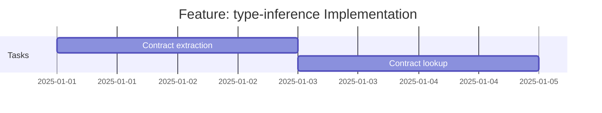

# Feature: type-inference - Checklist

## Gantt Chart

## Task Checklist

> **Note**: Tasks will be defined when this feature is commenced.

- [ ] Implement ContractRequest type helper
- [ ] Implement ContractResponse type helper
- [ ] Implement ContractError type helper
- [ ] Implement ContractByName lookup type
- [ ] Implement contract binding utilities
- [ ] Implement ContractRegistry type
- [ ] Add JSDoc documentation

## Acceptance Criteria

- [ ] All types compile under `strict: true`
- [ ] Type inference correctly extracts request/response types
- [ ] ContractByName correctly filters contracts
- [ ] Binding types enforce complete implementation
- [ ] JSDoc comments with examples
