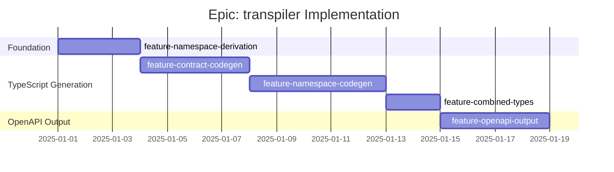

# Epic: transpiler - Checklist

## Gantt Chart

## Feature Checklist

- [ ] **feature-namespace-derivation** - Path to namespace conversion
  - Parse URL paths into segments
  - Convert segments to PascalCase
  - Handle path parameters (`{id}` → decision on flatten vs sub-namespace)
  - Build namespace hierarchy tree
  - Group contracts by namespace
  - Files: `src/transpiler/namespace.ts`

- [ ] **feature-contract-codegen** - Contract array generation
  - Generate `contracts` array with all contracts
  - Apply `as const` assertions for type inference
  - Inline JSON schemas (no external refs)
  - Generate base types: `Contracts`, `Contract`, `ContractName`
  - Handle optional fields (request, error, etc.)
  - Files: `src/transpiler/contracts.ts`

- [ ] **feature-namespace-codegen** - Per-namespace type generation
  - Generate `namespace` block for each namespace
  - Generate contract types using `ContractByName`
  - Generate response types using `FromSchema`
  - Generate request types (conditional on contract having request)
  - Generate contract instances via `contracts.find()`
  - Generate `miniclient()` factory function
  - Generate `Binding<T>`, `MiniBinding<T>`, `FullBinding<T>` types
  - Generate assertion types
  - Files: `src/transpiler/namespaces.ts`

- [ ] **feature-combined-types** - Combined binding types
  - Generate `IContractCLI<T>` (all bindings intersected)
  - Generate `IContractMCP<T>` (same as CLI)
  - Generate `PrefixedMiniBinding<Prefix, T>` helper
  - Generate any cross-namespace utilities
  - Files: `src/transpiler/combined.ts`

- [ ] **feature-openapi-output** - OpenAPI 3.1 output generation
  - Convert ContractedAPI spec to OpenAPI 3.1 structure
  - Map contracts to operations (handle multiple per path.method)
  - Convert field aliases back (spec→paths, events→webhooks)
  - Preserve components section
  - Output as YAML or JSON
  - Files: `src/transpiler/openapi.ts`

## Acceptance Criteria

### Must Have
- [ ] Generated TypeScript compiles without errors
- [ ] `as const` assertions enable literal type inference
- [ ] Namespace structure reflects URL path hierarchy
- [ ] All contracts accessible by name via `ContractByName`
- [ ] `FromSchema` correctly infers request/response types
- [ ] OpenAPI output validates against OpenAPI 3.1 spec

### Should Have
- [ ] Generated code is formatted (consistent style)
- [ ] Helpful comments in generated code
- [ ] Source map or traceability to source contracts
- [ ] Configurable output paths

### Nice to Have
- [ ] Prettier integration for formatting
- [ ] Watch mode for regeneration on change
- [ ] Incremental generation (only changed contracts)
- [ ] Multiple output targets (ESM, CJS)
