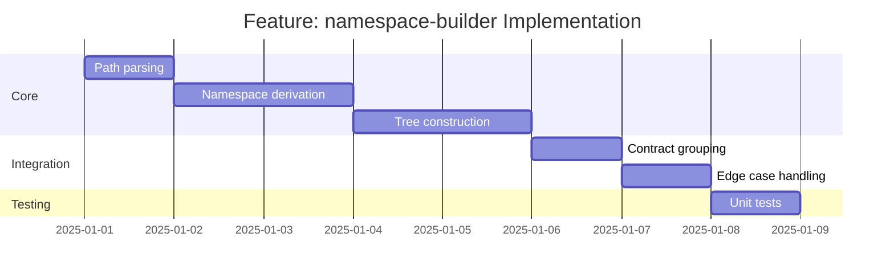

# Feature: namespace-builder - Checklist

## Gantt Chart

## Task Checklist

- [ ] Define `NamespaceNode` type
  - Name (PascalCase)
  - Children (nested namespaces)
  - Contracts (contracts at this level)
- [ ] Define `NamespaceTree` type
  - Root node collection
  - Lookup methods
- [ ] Create `pathToSegments(path: string): string[]`
  - Split on `/`
  - Filter empty strings
  - Preserve path parameters as segments
- [ ] Create `segmentToNamespace(segment: string): string`
  - PascalCase conversion
  - Handle path parameters (`{id}` → `Id` or `_id`)
  - Handle special characters
- [ ] Create `pathToNamespace(path: string): string`
  - Combine segments with `.`
  - Handle root path special case
- [ ] Create `buildNamespaceTree(contracts: Contract[]): NamespaceTree`
  - Group contracts by namespace
  - Build tree structure
  - Handle nesting
- [ ] Create `getNamespaceContracts(tree: NamespaceTree, namespace: string): Contract[]`
  - Lookup contracts by namespace
- [ ] Handle path parameter strategies
  - Flatten: `/users/{id}` → `Users`
  - Include: `/users/{id}` → `Users.Id`
  - Configurable option
- [ ] Handle edge cases
  - Root path `/`
  - Deep nesting `/a/b/c/d/e`
  - Mixed path params `/users/{id}/posts/{postId}`
- [ ] Write unit tests

## Acceptance Criteria

- [ ] All paths correctly converted
- [ ] Tree structure valid for code generation
- [ ] Contracts accessible by namespace
- [ ] Edge cases handled gracefully
