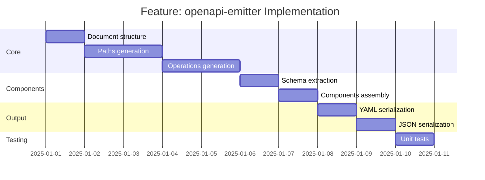

# Feature: openapi-emitter - Checklist

## Gantt Chart

## Task Checklist

- [ ] Create `OpenAPIEmitterOptions` interface
  - Output format (yaml/json)
  - OpenAPI version (3.0.3, 3.1.0)
  - Info metadata
  - Server URLs
- [ ] Create `emitDocument(spec: Specification, options: OpenAPIEmitterOptions): OpenAPIDocument`
  - Build complete document structure
  - Include all sections
- [ ] Create `emitInfo(options: OpenAPIEmitterOptions): InfoObject`
  - Title, version, description
  - Contact, license
- [ ] Create `groupContractsByPath(contracts: Contract[]): Map<string, Contract[]>`
  - Group by path
  - Sort by path
- [ ] Create `emitPaths(contracts: Contract[]): PathsObject`
  - Iterate paths
  - Add operations for each method
- [ ] Create `emitOperation(contract: Contract): OperationObject`
  - operationId from contract name
  - tags from namespace
  - summary from description
  - requestBody (if applicable)
  - responses
- [ ] Create `emitRequestBody(contract: Contract): RequestBodyObject`
  - Content type (application/json)
  - Schema from contract.request
- [ ] Create `emitResponses(contract: Contract): ResponsesObject`
  - 200 response with schema
  - Error responses (if defined)
- [ ] Create `extractComponents(spec: Specification): ComponentsObject`
  - Pull schemas from contracts
  - Deduplicate
  - Convert refs
- [ ] Create `serializeYAML(doc: OpenAPIDocument): string`
  - Pretty YAML output
- [ ] Create `serializeJSON(doc: OpenAPIDocument): string`
  - Pretty JSON output
- [ ] Create main `emit(spec: Specification, options?: OpenAPIEmitterOptions): string`
  - Build document
  - Serialize to string
- [ ] Handle edge cases
  - Contracts without request
  - Multiple response codes
  - Path parameters
- [ ] Write unit tests

## Acceptance Criteria

- [ ] Output validates against OpenAPI spec
- [ ] All contracts represented
- [ ] Path parameters correct
- [ ] Components properly extracted
- [ ] YAML and JSON both work
