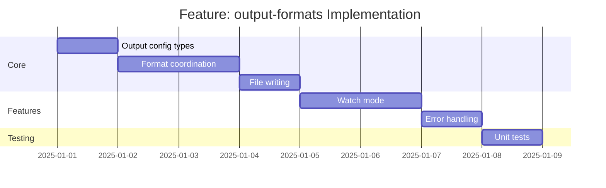

# Feature: output-formats - Checklist

## Gantt Chart

## Task Checklist

- [ ] Define `OutputFormat` type
  - `"typescript" | "openapi-yaml" | "openapi-json"`
- [ ] Define `OutputConfig` interface
  - Formats array
  - Output directory
  - Per-format options
  - Watch mode flag
- [ ] Create `determineOutputPath(format: OutputFormat, config: OutputConfig): string`
  - Build full path for each format
  - Handle custom filenames
- [ ] Create `generateOutput(spec: Specification, format: OutputFormat): string`
  - Dispatch to appropriate emitter
  - Return string content
- [ ] Create `writeOutput(path: string, content: string): Promise<void>`
  - Ensure directory exists
  - Write file atomically
  - Handle write errors
- [ ] Create `transpile(spec: Specification, config: OutputConfig): Promise<TranspileResult>`
  - Generate all formats
  - Write all files
  - Return result summary
- [ ] Create `TranspileResult` type
  - Success/failure status
  - Files written
  - Errors encountered
- [ ] Implement watch mode
  - Detect source file changes
  - Re-transpile on change
  - Debounce rapid changes
- [ ] Create `ensureDir(path: string): Promise<void>`
  - Create directory if missing
  - Handle nested directories
- [ ] Handle edge cases
  - Empty specification
  - Write permission errors
  - Invalid output path
  - Concurrent writes
- [ ] Write unit tests

## Acceptance Criteria

- [ ] All formats generate correctly
- [ ] Files written to correct paths
- [ ] Directories created as needed
- [ ] Watch mode triggers on changes
- [ ] Errors reported clearly
