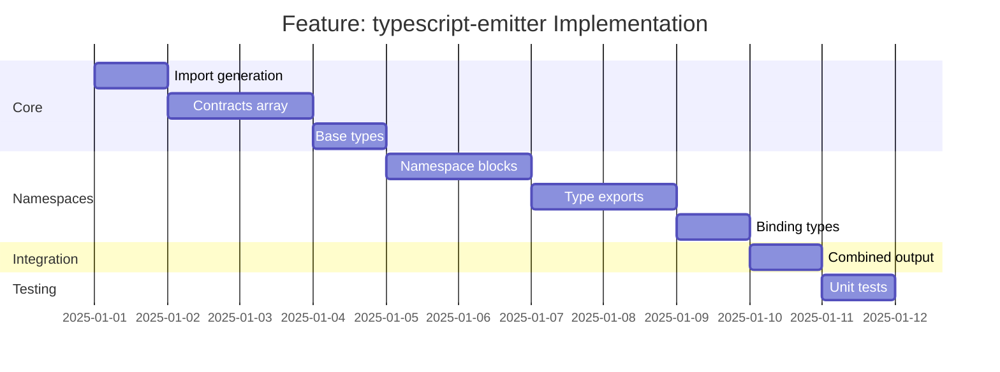

# Feature: typescript-emitter - Checklist

## Gantt Chart

## Task Checklist

- [ ] Create `EmitterOptions` interface
  - Indent style (spaces/tabs)
  - Import path configuration
  - Formatting options
- [ ] Create `emitImports(options: EmitterOptions): string`
  - FromSchema, ContractByName imports
  - Client create import
  - Custom imports
- [ ] Create `emitContractsArray(contracts: Contract[]): string`
  - Iterate contracts
  - Emit each with `as const`
  - Wrap in `export const contracts = [...] as const;`
- [ ] Create `emitContractObject(contract: Contract): string`
  - Emit name, path, method
  - Emit request schema (if present)
  - Emit response schema
  - Handle nested objects properly
- [ ] Create `emitBaseTypes(): string`
  - `Contracts = typeof contracts`
  - `Contract = Contracts[number]`
  - `ContractName = Contract["name"]`
- [ ] Create `emitNamespace(node: NamespaceNode): string`
  - Namespace declaration
  - Contract types
  - Response types
  - Request types (conditional)
  - Contract instances
  - Miniclient factory
  - Binding types
- [ ] Create `emitContractType(contract: Contract): string`
  - `export type ${Name}Contract = ContractByName<...>`
- [ ] Create `emitResponseType(contract: Contract): string`
  - `export type ${Name}Response = FromSchema<...>`
- [ ] Create `emitRequestType(contract: Contract): string`
  - Conditional if request exists
- [ ] Create `emitMiniClient(contracts: Contract[]): string`
  - Factory function with typed returns
- [ ] Create `emitBindingTypes(contracts: Contract[]): string`
  - Binding, MiniBinding, FullBinding
  - Assert types
- [ ] Create `emitCombinedTypes(namespaces: NamespaceNode[]): string`
  - IContractCLI intersection
  - IContractMCP
- [ ] Create main `emit(spec: Specification, options?: EmitterOptions): string`
  - Orchestrate all emission
  - Assemble final output
- [ ] Handle edge cases
  - Empty namespaces
  - Contracts without request
  - Special characters in names
- [ ] Write unit tests

## Acceptance Criteria

- [ ] Output is valid TypeScript
- [ ] All contracts included
- [ ] Namespace structure matches tree
- [ ] Types are correctly generated
- [ ] Output compiles with `tsc`
